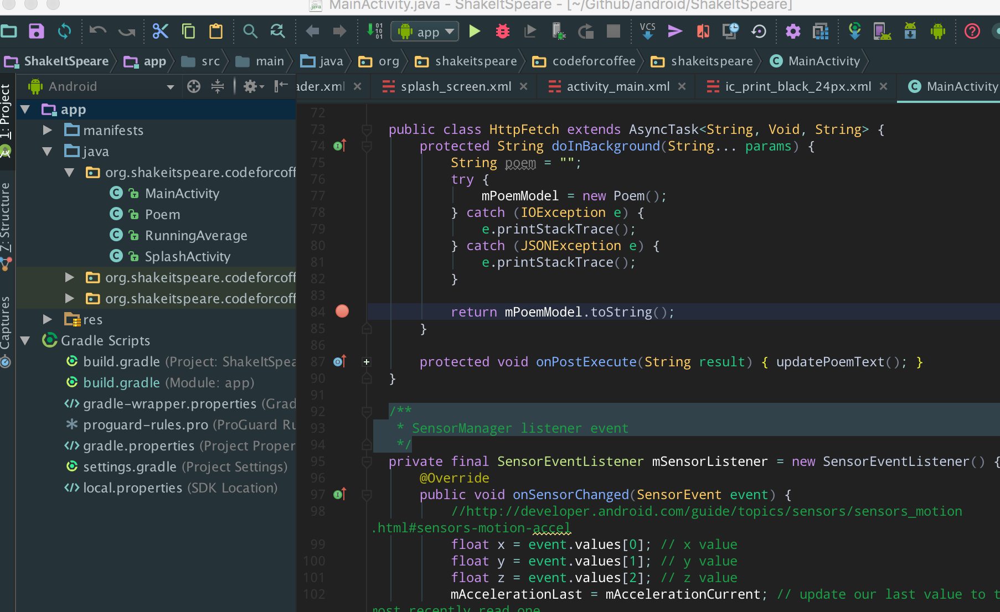
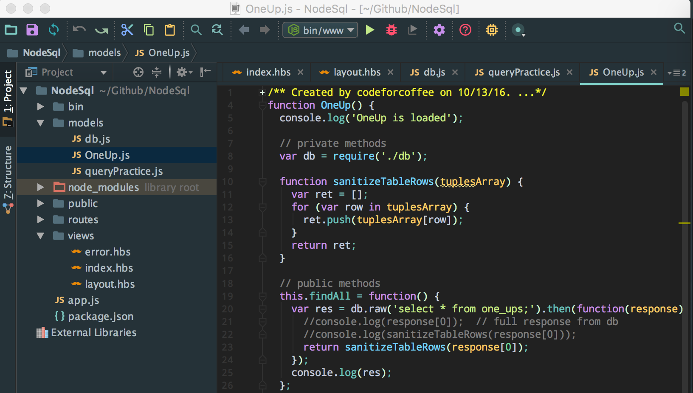

# jetbrains-aurora-theme
Custom dark text theme for use with Jetbrains IDEs (Webstorm, Android Studio, RubyMine, etc) + material-theme

## Installation

1. Clone this repository (or download the Aurora theme file). 
2. Save the `*.icls` file in `~/Library/Preferences/<Path to each IntelliJ Platforms>/colors/` (create the **colors** directory if it does not exist.
3. Open you JetBrains editor and select **Preferences**.
4. Select **Editor**
5. Select **Colors and Font**
6. In the right panel, select **Aurora** from the theme dropdown.

## IDE Theme

JetBrains comes with two default IDE themes; normal and darkula. This text theme supports _dark IDE fonts only_. I highly suggest using @ChrisRM's [material-theme-jetbrains](https://github.com/ChrisRM/material-theme-jetbrains) over Darkula.

#### Screenshots

**Android Studio**

**WebStorm**

